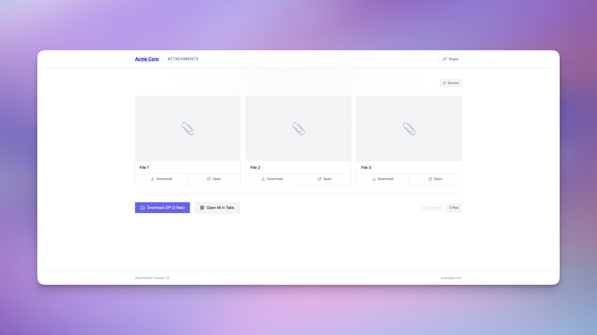

# Uploadcare Gallery Worker

A Cloudflare Worker that transforms raw Uploadcare group URLs into a beautiful, branded file gallery.


<p align="center">
  
</p>

## The Problem

Uploadcare supports **file groups** — a way to bundle multiple uploaded files under a single URL. This is useful when a form field accepts multiple attachments:

```
https://your-project.ucarecdn.com/20a62b9a-96be-4782-9016-6a82ce5ef6c7~3/
```

But the default group page is barebones: no thumbnails, no real filenames, no branding. When these URLs end up in your CRM, helpdesk, or team notifications, they're nearly unusable.

## The Solution

This worker wraps those URLs in a clean gallery page:

```
https://your-worker.workers.dev/?url=https://your-project.ucarecdn.com/...
```

The gallery works with **any** Uploadcare group URL — whether it comes from Webflow, a custom app, your own backend, or anywhere else. Just pass the URL to the worker.

**Features:**
- 🖼️ Thumbnail previews for all files
- 📝 Real filenames (fetched from Uploadcare headers)
- ⬇️ Download individual files or ZIP all
- 🔗 Open all in tabs
- 📋 Share button (copy gallery URL to clipboard)
- ✅ Session-based "viewed" tracking
- 📍 Source page + timestamp metadata
- 🎨 Fully white-labelable (your logo, colors, fonts)
- 📱 Responsive design

## Quick Start

### 1. Clone & Install

```bash
git clone https://github.com/yourusername/uploadcare-gallery-worker.git
cd uploadcare-gallery-worker
npm install
```

### 2. Configure

```bash
cp wrangler.toml.example wrangler.toml
```

Edit `wrangler.toml` with your:
- Cloudflare account ID
- Uploadcare CDN hostname
- Company branding (name, colors, logo, fonts)

### 3. Deploy

```bash
npm run deploy
```

## Configuration

All branding is controlled via environment variables in `wrangler.toml`.

### Required

| Variable | Description |
|----------|-------------|
| `ALLOWED_CDN_HOSTS` | Uploadcare CDN hostname(s), comma-separated |
| `COMPANY_NAME` | Displayed in header, page title, and meta description |
| `COMPANY_URL` | Logo links here |
| `WORKER_URL` | Full URL of your deployed worker |

### Branding

| Variable | Required | Description |
|----------|----------|-------------|
| `BRAND_COLOR` | ✅ | Primary accent color (hex, e.g., `#0066FF`) |
| `FAVICON_URL` | ✅ | URL to your favicon |
| `LOGO_SVG` | ⬜ | Inline SVG logo (preferred) |
| `LOGO_URL` | ⬜ | URL to logo image (fallback if no SVG) |

### Typography

| Variable | Required | Description |
|----------|----------|-------------|
| `FONT_BODY` | ✅ | Font family for body text (e.g., `Inter`) |
| `FONT_DISPLAY` | ✅ | Font family for headings (e.g., `Inter`) |
| `FONT_CSS_URL` | ⬜ | Custom font CSS URL (skips Google Fonts if set) |

### Behavior

| Variable | Default | Description |
|----------|---------|-------------|
| `MAIN_ACTION` | `download` | Card click behavior: `download` or `open` |

### Theme Colors (Optional)

Set these to customize the color scheme (e.g., for dark themes). All color vars support any CSS color format (hex, rgba, hsl, etc.):

| Variable | Default | Description |
|----------|---------|-------------|
| `SUCCESS_COLOR` | `#16a34a` | Success/confirmation color |
| `LINK_HOVER_COLOR` | inherit | Link hover color |
| `BG_COLOR` | `#ffffff` | Page background |
| `PANEL_COLOR` | `#f9fafb` | Panel/card backgrounds |
| `SURFACE_COLOR` | `#f3f4f6` | Interactive surfaces (hover states) |
| `BORDER_COLOR` | `#e5e7eb` | Borders |
| `TEXT_COLOR` | `#111827` | Primary text |
| `TEXT_SECONDARY_COLOR` | `#6b7280` | Secondary text |
| `TEXT_MUTED_COLOR` | `#9ca3af` | Muted text |
| `HEADER_BG` | `#ffffffcc` | Header background (supports alpha via 8-digit hex) |

### Example Configuration

```toml
[vars]
ALLOWED_CDN_HOSTS = "abc123.ucarecdn.com"
COMPANY_NAME = "Acme Corp"
COMPANY_URL = "https://acme.com"
WORKER_URL = "https://files.acme.workers.dev"
BRAND_COLOR = "#FF6600"  # Your brand's accent color
FAVICON_URL = "https://acme.com/favicon.ico"
LOGO_URL = "https://acme.com/logo.png"
FONT_BODY = "Inter"
FONT_DISPLAY = "Inter"
```

## Endpoints

| Path | Description | Caching |
|------|-------------|---------|
| `/?url=...` | Gallery viewer | 1 hour |
| `/uc-gallery-connect.js?v=X.X.X` | Client-side URL transformer | Immutable (use version for cache busting) |

## Client-Side Integration

The `/uc-gallery-connect.js` script transforms Uploadcare group URLs into gallery URLs before form submission. This is useful when you want the transformation to happen automatically on the client side.

> **Note:** The included script is built for Webflow + Uploadcare's file uploader widget, but can be adapted for other platforms.

### Option 1: Load from Worker (Recommended)

One script tag, auto-configured. Add to your site's footer code:

```html
<!-- UC Gallery Connect - transforms Uploadcare URLs to gallery URLs -->
<script src="https://your-worker.workers.dev/uc-gallery-connect.js?v=1.2.0"></script>
```

The worker URL is injected automatically. Update the `?v=` parameter to bust cache when upgrading.

### Option 2: Inline the Script

Copy [`uc-gallery-connect.example.js`](./uc-gallery-connect.example.js) into your site's custom code and set your worker URL:

```javascript
const WORKER_URL = 'https://your-worker.workers.dev';
```

### Option 3: Self-Host the Script

Host the script on your own CDN (R2, S3, Cloudflare Pages, etc.). Copy `uc-gallery-connect.example.js`, replace `__WORKER_URL__` with your worker URL, and serve it from your CDN.

### What the Script Does

1. Listens for Uploadcare `group-created` events
2. Transforms the raw CDN URL → your gallery URL
3. Adds metadata (source page slug, timestamp)
4. Updates the form's hidden input

Now when forms submit to your CRM/backend, they contain gallery URLs instead of raw Uploadcare URLs.

## Security

| Feature | Implementation |
|---------|----------------|
| **CDN Allowlist** | Only URLs from configured `ALLOWED_CDN_HOSTS` are accepted |
| **URL Validation** | Strict regex matching for Uploadcare group URL format |
| **File Count Limit** | Configure in Uploadcare project settings |
| **No Indexing** | `noindex, nofollow` meta tags |
| **CORS** | Only enabled for `/uc-gallery-connect.js` endpoint |

## Development

```bash
# Start local dev server
npm run dev

# Type check
npx tsc --noEmit

# Deploy to Cloudflare
npm run deploy

# View live logs
npm run tail
```

## How It Works

```
┌─────────────────┐     ┌──────────────────┐     ┌─────────────────┐
│   Your Form     │────▶│ uc-gallery-      │────▶│   Your CRM/     │
│   + Uploadcare  │     │ connect.js       │     │   Backend       │
└─────────────────┘     └──────────────────┘     └─────────────────┘
                                                          │
                                                          ▼
┌─────────────────┐     ┌──────────────────┐     ┌─────────────────┐
│   Uploadcare    │◀────│  This Worker     │◀────│   User clicks   │
│   CDN           │     │  (renders gallery)│    │   link          │
└─────────────────┘     └──────────────────┘     └─────────────────┘
```

> **Without uc-gallery-connect.js:** You can skip the client-side script entirely and transform URLs server-side, or even manually prepend the worker URL when needed.

## Alternative Hosting

This project is built for **Cloudflare Workers** and deploys with `wrangler`. If you want to host on a different platform (Vercel Edge Functions, Deno Deploy, AWS Lambda@Edge, etc.), you'll need to adapt the code:

- The worker uses Cloudflare's `Request`/`Response` APIs (standard Fetch API, so most platforms are compatible)
- Environment variables are accessed via the `env` parameter in the fetch handler
- No Cloudflare-specific APIs are used, so porting should be straightforward

This isn't officially supported, but the codebase is simple enough to adapt.

## Dependencies

- **Runtime**: None (pure Cloudflare Workers)
- **Client-side**: JSZip (loaded from CDN for ZIP downloads)
- **Dev**: TypeScript, Wrangler

## License

MIT License - see [LICENSE](LICENSE) for details.

## Contributing

Contributions welcome! Please open an issue first to discuss proposed changes.
